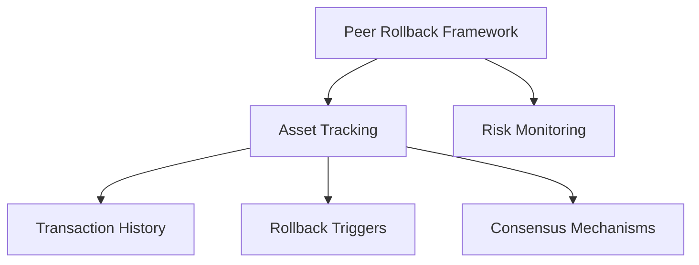

# Peer Rollback Framework

A decentralized risk management protocol for secure asset tracking, providing advanced contingency planning and peer-driven rollback mechanisms.

## Overview

The Peer Rollback Framework empowers users with:
- Comprehensive asset tracking and risk monitoring
- Decentralized contingency planning
- Peer-driven asset recovery and rollback strategies
- Immutable transaction and valuation records
- Advanced privacy and access control mechanisms
- Collaborative risk mitigation tools

## Architecture

The framework is designed around collaborative risk management, enabling users to define, track, and potentially rollback asset transactions through a distributed consensus mechanism.



### Core Components:
- **Transaction Tracking**: Immutable record of asset movements
- **Risk Thresholds**: Configurable risk detection parameters
- **Consensus Mechanisms**: Peer validation for rollback actions
- **Privacy Controls**: Granular access and visibility settings
- **Recovery Strategies**: Predefined asset protection protocols

## Contract Documentation

### Main Contract: peer-rollback-tracker.clar

The core contract implementing the Peer Rollback Framework's core functionality.

#### Key Data Structures:
- `assets`: Detailed asset tracking and metadata
- `transaction-history`: Comprehensive transaction records
- `risk-thresholds`: Configurable risk detection rules
- `rollback-consensus`: Peer validation mechanisms
- `access-controls`: Granular permission management

## Getting Started

### Prerequisites
- Clarinet CLI
- Stacks-compatible wallet
- Understanding of decentralized risk management

### Basic Usage

1. Initialize asset tracking:
```clarity
(contract-call? .peer-rollback-tracker register-asset 
    "crypto-portfolio"     ;; Asset Group ID
    "Crypto Investment"    ;; Portfolio Name
    "digital-assets"       ;; Category
    u1672531200            ;; Tracking Start Date
    u100000                ;; Initial Portfolio Value
    u100000                ;; Current Portfolio Value
    none                   ;; Optional Metadata
    false                  ;; Public Visibility
)
```

2. Set Risk Threshold:
```clarity
(contract-call? .peer-rollback-tracker set-threshold
    "crypto-portfolio"     ;; Asset Group ID
    "downside-protection"  ;; Threshold ID
    "lt"                   ;; Comparison (less than)
    u90000                 ;; Threshold Value
    (some "10% Loss Alert") ;; Optional Description
)
```

3. Track Asset Changes:
```clarity
(contract-call? .peer-rollback-tracker update-asset-value 
    "crypto-portfolio" 
    u95000                 ;; Updated Portfolio Value
)
```

## Function Reference

### Asset Management

#### register-asset
```clarity
(register-asset 
    (group-id (string-ascii 36))
    (name (string-utf8 100))
    (category (string-ascii 50))
    (tracking-start uint)
    (initial-value uint)
    (current-value uint)
    (metadata (optional (string-utf8 1000)))
    (public-visibility bool))
```

#### update-asset-value
```clarity
(update-asset-value 
    (group-id (string-ascii 36)) 
    (new-value uint))
```

### Risk Management

#### set-threshold
```clarity
(set-threshold
    (group-id (string-ascii 36))
    (threshold-id (string-ascii 36))
    (comparison (string-ascii 2))
    (trigger-value uint)
    (description (optional (string-utf8 200))))
```

#### initiate-rollback
```clarity
(initiate-rollback
    (group-id (string-ascii 36))
    (rollback-point uint)
    (rollback-reason (string-utf8 200)))
```

## Development

### Local Testing

1. Initialize project:
```bash
clarinet new peer-rollback
```

2. Run tests:
```bash
clarinet test
```

3. Start local chain:
```bash
clarinet console
```

## Security Considerations

### Risk Mitigation
- Decentralized consensus for critical actions
- Immutable transaction tracking
- Multi-step verification for high-risk operations

### Access Control
- Granular permission management
- Time-bound and role-based access
- Transparent authorization logs

### Privacy Protections
- Selective data exposure
- Encrypted metadata storage
- Configurable visibility thresholds

### Limitations & Considerations
- Rollback mechanisms have time and value constraints
- Consensus requires minimum peer participation
- External oracle integration may be needed

### Best Practices
- Define clear risk thresholds
- Implement multi-signature approvals
- Regularly audit access logs
- Use optional metadata for sensitive information
- Validate all input parameters rigorously